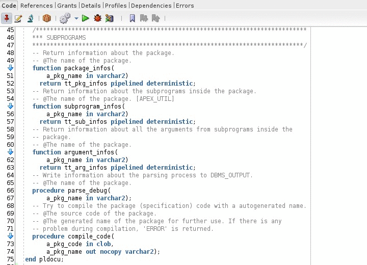
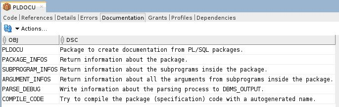

# PLDocu

## Introduction
PLDocu is a PL/SQL Package to extract the necessary information from your source code to build a documentation.

## Installation
Simply run the install script from the setup folder inside SQL*Plus or SQL Developer.

## Usage
The following example extract the information from package "PLDOCU":

```
select * 
from table(pldocu.package_infos('PLDOCU'))
join table(pldocu.subprogram_infos('PLDOCU')) using (pkg_id)
left join table(pldocu.argument_infos('PLDOCU')) using (pkg_id, sub_id)
order by sub_id, arg_id;
```

Because "PLDOCU" do not use procedures with zero arguments, this query works too:

```
select * 
from table(pldocu.package_infos('PLDOCU'))
natural join table(pldocu.subprogram_infos('PLDOCU'))
natural join table(pldocu.argument_infos('PLDOCU'))
order by sub_id, arg_id;
```



## User Defined Extension for Oracle SQL Developer

In SQL Developer go to Tools > Preferences > Database > User Defined Extension.
Click add row and select EDITOR as type. Then select the pldocu.xml file. 
Restart...



## License
PLDocu is released under the [MIT license](https://github.com/teotiger/pldocu/blob/master/license.txt).

## Version History
Version 0.2 – April 15, 2018
* Extension for SQL Developer added

Version 0.1 – March 31, 2018
* Initial release

